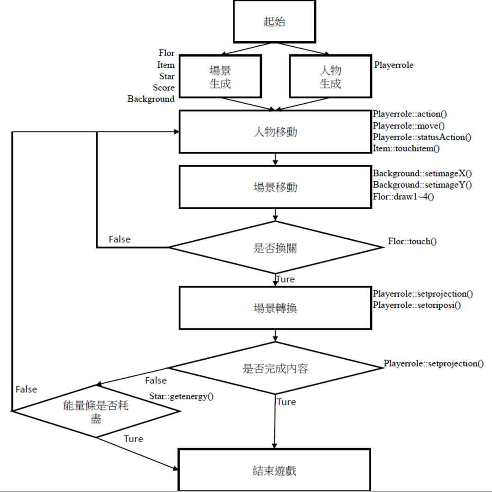
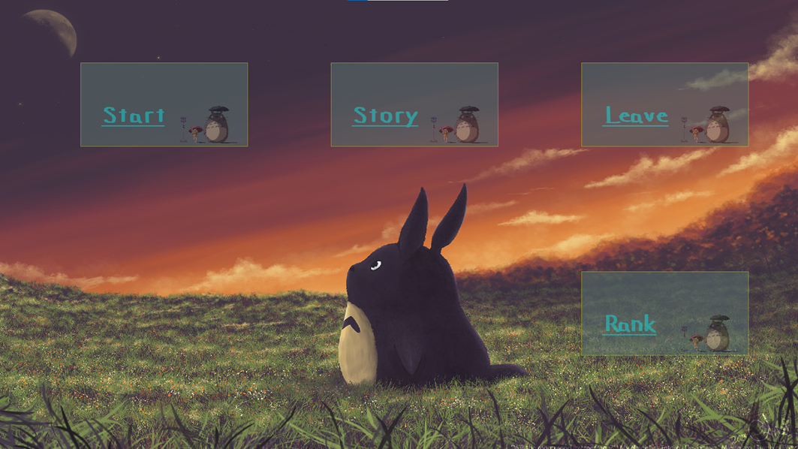
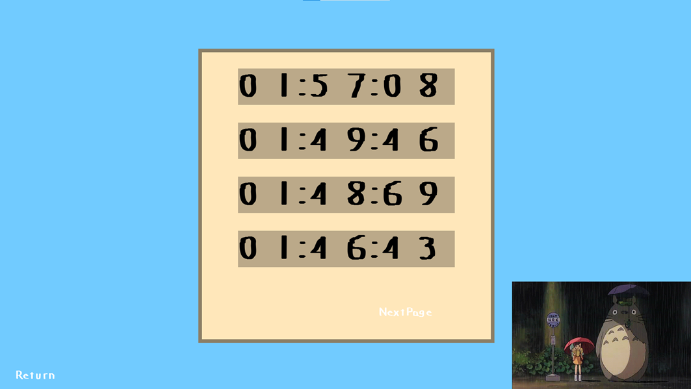
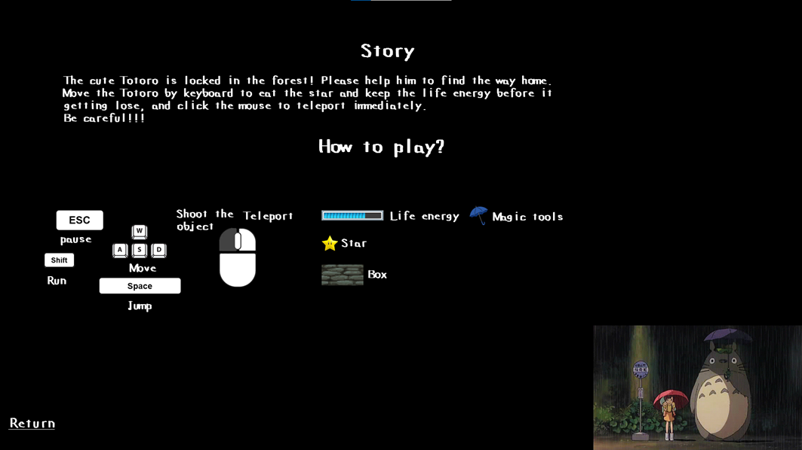
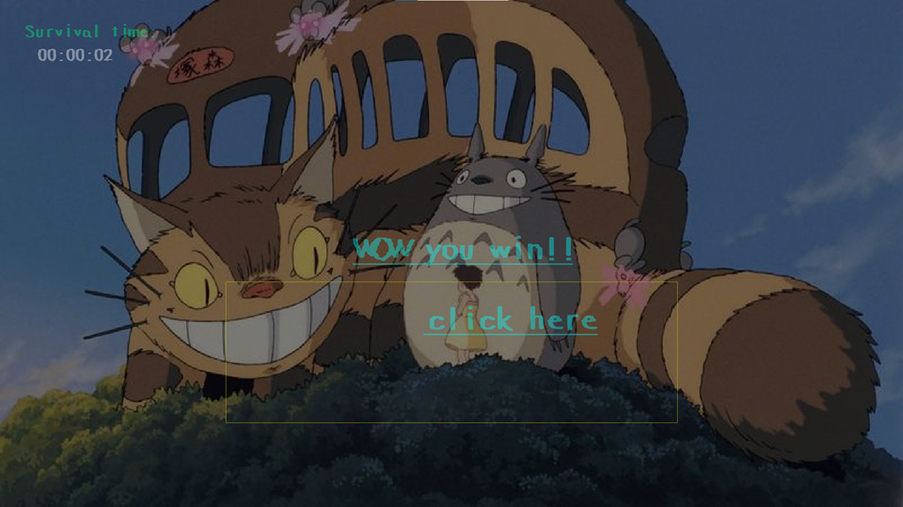

# ToToRo大冒險

### 題目描述
**專題內容:**
是一款解謎取向的闖關遊戲，透過橫向卷軸的方式，操控角色，並透過身上的道具，與場景互動，最終幫助我們的主角Totoro突破重重難關，回到草壁五月(小月)身邊。

1. 人物移動時，面朝不同邊，讀取特定的圖片，停止不動時，也讀取特定圖片，這樣角色便有了等待，面朝左，面朝右，走路，等狀態。
2. 人物跳躍時，有考慮重力加速度的概念，跳起來時，會隨著時間感受到物力的影響，同理下墜時也是。
3. 地圖移動時，由於橫向捲著的緣故，當角色畫面右側一定距離時(上下左同理)，背景也會跟著移動，此處的程式技巧在於，由於當背景跟著移動時，原本在圖中的畫面也要跟著移動，所以為了保持物體位置相對於主角是沒有改變的，因此畫出來的物件須更改相對位置(相對座標 = 絕對座標-縮放倍率*背景座標)
4. 特殊物件-雨傘: 能夠在圖中，並藉由主角觸碰而將該道具拿在手上，能夠將跳躍功能變更成飛越，並且下墜時，會有緩速下墜的效果。
5. 特殊物件-順移魔法: 能夠射出一條拋物線，並在線條消失前點擊滑鼠右鍵然後移動到著陸點。
6. 特殊物件-冰塊地板: 不同的摩擦係數，當角色在該地板停止移動時，還會滑行一段距離。
7. 特殊物件-沙地板: 不同的摩擦係數，當角色在該地板移動時，速度明顯下降。
8. 特殊物件-消失箱子: 當該地板觸碰過角色一瞬間，開始倒數3秒，3秒後地板會消失，並取消碰撞，角色便無法站在上面，且當消失時間經過3秒後，地板會重新顯示，並恢復碰撞。
9. 特殊物件-小鳥: 隨機於地圖任何地方產生，並隨機丟下小碎石，當主角被小碎石觸碰時，快速降低能量條，並且短暫閃過用以遮蔽視線。
10. 特殊物件-移動地板: 地板會依照設定路線來回上下or左右移動。
11. 特殊物件-星星: 當主角碰到星星時，會將星星吃掉，並能夠提升1點能量值，且在方向鍵持續下壓時(僅吃到當次有效)，巨幅增加移動速度，直到方向鍵彈起，則取消效果。
12. 特殊物件-能量條: 主角能夠行動的能量值!!! 當歸零時則遊戲結束。
13. 特殊物件-移動小碎石: 固定於場景中依照指定路線移動，觸碰到角色時，會快速降低能量值。
14. Rank排名。
15. 存活時間計時(單位:分,秒,毫秒)。
16. 背景故事與操作手冊。

### UML架構圖

### Class介紹
|Class|Function|
|----|----|
|Playerrole::action(), Playerrole::statusAction()|action()會調控人物的狀態，例如跳躍、蓄力、飛；statusAction()會控制人物的左走、右走、停止的狀態；由action()以及statusAction()得到的數值這些狀態會傳給move進行處理|
|Playerrole::move()|move()會將上述的移動轉化為背景移動或人物移動的速度|
|Item::touchitem()|是否有吃到道具|
|Background::setimageX(), Background::setimageY()|如人物已經走到不能移動限制區時，如若背景未達可移動隻最大距離，便會移動此項|
|Flor::draw2~4()|Flor物件中的地板因功能較多，因此分為三種畫法，這三種畫法會直接影響物體位置
Draw2:
無特殊功能的地板，會依照給 予的位置出現在相應的區域，並在碰出時給予碰撞或停駐的功能
Draw3:
可使地板依照給予的參數進行 移動，上下左右以及速度和距離
Draw4:可與Playerrole類別中創建的怪物進行互動Playerrole::randwalk()，設定丟擲物體的地點Flor::setthroposi()以及是否要丟Flor::getthro()|
|Flor::touch()|判斷Playerrole與碰觸到的地板產生互動以及如何互動，無特殊功能的地板則是提供碰撞或停駐的功能，特殊功能則依照設定時的數值給予消失Flor::disapp()、減少星星Star::energy-1、傳送地圖playerrole::setprojection()|
|Playerrole::setoriposi()|設定每一關卡的初始地點|
|Playerrole::setprojection()|設定第幾個關卡|
|Star::getenergy()|計算還剩餘的能量以此判斷遊戲是否結束|
### 執行結果

遊戲選單畫面-一開始先點選右側Rank，可以查看之前遊玩過的存活時間，存活時間越長，排名越前面。

單位分別為: min : sec : ms，可以切換下一頁

之後回到主選單可以進入-Story 裡面有故事劇情與操作教學

此為遊戲勝利畫面~~(該圖存活時間僅供參考)
### 專題關鍵
道具-線的部分: 要讓他從發射的點開始消失，解決方式是利用vector將陣列中的第一個，每次迭代時都拿掉。
地板的部分: 
1. 我們的地板是一塊獨立的方塊，且因為地圖是橫向卷軸，因此要將地板放到我們想要的位置並顯示出來，我們是想一個算法能夠讓地圖內所有的物件都能夠依照人物在背景的位置，顯示出那塊背景應該要有的地板方塊
，算法就是透過**原始物件的絕對位置 - 縮放倍率*背景座標 得出 “相對位置”**，並將相對位置畫出來。
2. 因為我們的地板可能會有很多塊，所以利用vector創建class的陣列，但在vector中close會有問題，猜測是因為初始化的時候沒有參數值，因此導致close時沒有texture物件，所以這邊是先創建class的指標陣列，在new一塊新的記憶體空間創建有參數的class。
3. 地板同時考慮不同性質會有不同摩擦係數，例如冰塊的地板，是透過當方向件從下壓狀態離開時且地板為冰塊，速度會扣除一個逐漸變大的變數，才會停下來，以此產生漂移的感受；沙子地板則為增加摩擦力，當位於上方時，可以明顯感受到移動速度下降。

4. 人物面朝不同方向，和停止不動時顯示的部分: 由於一開始圖片包只有面向右邊的部分，所以透過複製圖片產生向左的部分，再從圖檔中，找出幾張停止移動時要顯示的畫面，透過給人物設定當按下方向鍵時，會有不同的狀態，並根據狀態只迴圈特定的一些圖片來解決此問題。
5. 人物從起跳到降落想呈現物理中重力加速度的感覺: 原本一開始的起跳，原本是設定往上跳幾格Y軸時，到點頂後(有限制一次跳躍的高度)，就下降幾個Y，但是這樣起跳只會有像是三角形的跳躍效果，看起來並不真實，因此後來將起跳時的向上的Y軸扣除一個變數，並透過迴圈，該變數便會越大，模仿重力的概念，並當向上的力達到0時，再計算原始起跳距離與當前高度，並開始向下加速，也可利用變數加迴圈使角色回到原始高度，這邊還有一個地方是如果碰到其他地板，則會有條件式判斷，讓地板位置=原始位置，則角色就可以跳到地板上了。

